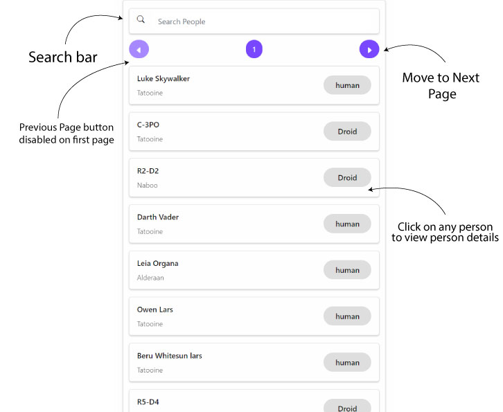
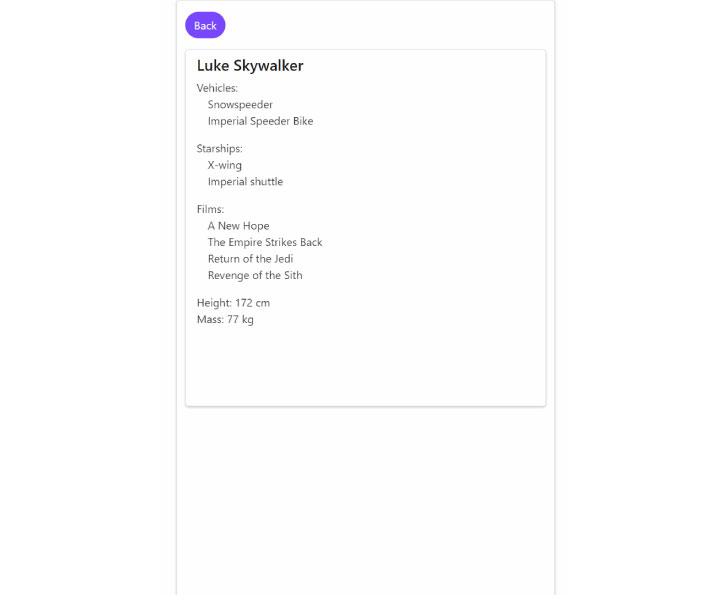

https://user-images.githubusercontent.com/83461696/126897223-e107d461-ad63-4330-90f5-c6f61c8bba69.mp4

# Starwars Contact List

Website Link: https://starwars-contact-list.netlify.app/

Developed by: Rishikesh Dubey

Data received from [Star Wars API](https://swapi.dev/)

In this application, You can find all the starwars characters, as if they were in your contact list. There are more than 80 characters for now. 

Data fetching is done with **react-query**'s usequery hook, which makes asynchronous data fetching a piece of cake. 

All the data is **paginated**, and at any given time, the app fetches atmost 10 people. You can move to the next or previous page using the provided buttons.

The previous page button gets disabled on the first page, and the next page data gets disabled on the last page

Also, you can **search** for any character by name, and find your favourite character in the list.

When any list item is clicked, You will get redirected to a page that displays details of that character. Details include starships, vehicles, films, mass and height.

The UI is kept **responsive**, so that the app does not break on small screens.

I thank **Hybrowlabs** for providing me the opportunity and motivation to work on this project
